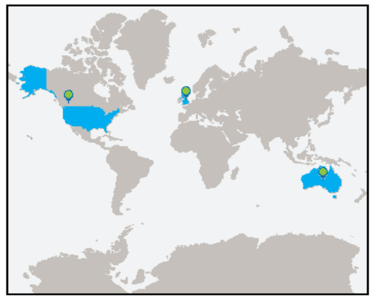

The "mapSOOSWG" package was written to semi-automate the creation of maps for SOOS reporting purposes. The package was created with some flexibility. This documentation details the functions, provide examples on how to use them and illustrates where map style can be altered slightly. The package runs off the SOOS AirTable set up. If you change the column names the code will break.

## Installation
The package is located on GitHub (https://github.com/KimBaldry/mapSOOSWG). To access the package you need to have "devtools" installed. 

The package can then be downloaded using the folliwing code:
```{r, eval = F, echo = T}
install.packages("devtools")
library(devtools)
# it is OK to skip updates when prompted 
devtools::install_github("KimBaldry/mapSOOSWG")
```

Don't forget, to use the package you need to call it everytime you begin a new R session:
```{r, eval = T, echo = T, results="hide", message=FALSE}
library(mapSOOSWG)
```

Once installed you should be able to use the functions easily! To test, run the following code:
```{r, eval = F, echo = T} 
plot_WG_map(WG_name = "Test", WG_countries = data.frame("ISO3" = c("GBR", "USA", "AUS")))
```

If the below plot was produced, the package is working. Don't worry if it appears a little blurry, thats normal. Time to get started!



## Required Input Data frames
Each function requires one or more input files. Example files are included in the "file_examples" subdirectory in where this documentation is located. Note these files can be named differently, just ensure you are pointing to the right file/data when you are using the functions. The package includes examples of what the data should look like once these files are uploaded into the R environment.

|Input data frame | R environment name to check | Example filename | Original File                                          |
|----------|--------------------|---------------------------------------------------------|
|SOOS_WG_data| example_WG_data | SOOSWG_file_22022020.csv | This should be generated from a ".csv" file exported from AirTable. It **must** include the "Acronym" and "Countries Represented" ("Countries.Represented" also accepted) columns and be named in this way. For the use of geocode_maps, it must also contain the "Afiliation" column. |
|country_names_data| example_country_data | country_lookup_table.txt | This should be generated from the ISO3 country names lookup table. It is manually upkept via a comma delimited ".txt" text file. It contains two columns. "Country" contains the SOOS country name and "ISO3_name" contains the corresponding ISO3 code.|
|institution_names_data| example_institution_data | Mapping institutes.csv | This should be generated from the geocodes lookup file. The file must contain 4 columns labeled "Name" (what SOOS records the Affiliations as), "Type", "Latitude" and "Longitude". |
|category_data| example_category_data| Category_example_file.csv | This file must contain 3 columns labeled "Acronym" (for the WG or plotname), "Countries.Represented" (A list of SOOS named countries separated by a ";") and "Categories" (a list of assigned categories for each SOOS country). This file can also be generated in the same way as SOOS_WG_data, and the relevent variable renamed "Categories" |

You can use head() or View() to see the top few rows of some example data and compare them to your own imported data.
```{r}
View(example_WG_data)
```

#### Examples for generating data frames from files
You can alter "filename" to the location of your file to read in new data.
SOOS_WG_data:
```{r, eval = F, echo = T}
maindir = "./" # this directory. Change to the directory where example data is stored
# set the path to your file
filename = file.path(maindir, "file_examples", "SOOSWG_file_22022020.csv")

# read the file
data = read.csv(filename, header = T,  stringsAsFactors = F)
colnames(data) = gsub("ï..","",colnames(data)) # this is a bug that can occur from excel (yay excel)


```

country_names_data:
```{r, eval = F, echo = T}
# set the path to your file
filename = file.path(maindir, "file_examples", "country_lookup_table.txt")

# read the file
data = read.csv(filename, header = T, stringsAsFactors = F,strip.white = T)

```

institution_names_data:
```{r, eval = F, echo = T}
# set the path to your file
filename =  file.path(maindir, "file_examples", "Mapping institutes.csv")

# read the file
data = read.csv(filename, header = T, stringsAsFactors = F,strip.white = T)
colnames(data) = gsub("ï..","",colnames(data)) # this is a bug that can occur from excel (yay excel)
```

category_data:
```{r, eval = F, echo = T}
# set the path to your file
filename = file.path(maindir, "file_examples", "Category_example_file.csv")

# read the file
data = read.csv(filename, header = T, stringsAsFactors = F,strip.white = T)
colnames(data) = gsub("ï..","",colnames(data)) # this is a bug that can occur from excel (yay excel)
```


## Main User Functions 
Below is a list of functions contained within the "mapSOOSWG" package and some brief information regarding their functionality.

The three main functions the user interacts with are:

| function | use                                                              | input data|
|----------|------------------------------------------------------------------|------------|
|WG_maps() | This will autogenerate Working Group participation maps with country centroids used as marker locations. | SOOS_WG_data, country_names_data |
|geocode_maps() | This will autogenerate Working Group participation maps with geocoded institution marker locations. Participating countries can also be coloured. | SOOS_WG_data, institution_names_data, country_names_data (optional) |
|category_maps() | This will autogenerate maps in which countries are coloured with reference to a list of country categories (in category_file). A basemap like that in WG_maps or geocode_maps can be chosen so markers are added to country centroids or geocodes. These markers can also be recoloured. | category_data, country_names_data, SOOS_WG_data (optional), institution_names_data (optional)|

#### Useing the functions to generate maps
The use of the functions is very simple. You need to feed the input data and direct to an output directory for the plots. Note that it will take a few minuites for all plots to be generated.

WG_maps:
To create maps with hilighted participating countries and markers at the geocentroid of countries:
```{r, eval = F, echo = T}
WG_maps(SOOS_WG_data = example_WG_data, outdir = "./output", country_names_data = example_country_data)
```
To create maps with hilighted participating countries and no markers:
```{r, eval = F, echo = T}
WG_maps(SOOS_WG_data = example_WG_data, outdir = "./output", country_names_data = example_country_data, add_marker = F, add_marker_dot = F)
```


geocode_maps:
To create maps with hilighted participating countries and geocoded instititutions:
```{r, eval = F, echo = T}
geocode_maps(SOOS_WG_data = example_WG_data, outdir = "./output",institution_names_data = example_institution_data, country_names_data = example_country_data)
```
To create maps with no hilighted participating countries and geocoded instititutions:
```{r, eval = F, echo = T}
geocode_maps(SOOS_WG_data = example_WG_dataa, outdir = "./output",institution_names_data = example_institution_data, add_countries = F)
```
Note that country_names_data is only required when "add_countries"" is set to true (default option)

category_maps:
Create category maps with no markers:
```{r, eval = F, echo = T}
category_maps(outdir = "./output",category_data = example_category_data, country_names_data = example_country_data)
```
Get rid of the legend:
```{r, eval = F, echo = T}
category_maps(outdir = "./output",category_data = example_category_data, country_names_data = example_country_data, plot_legend = F)
```
Create category maps with geocentroid country markers:
```{r, eval = F, echo = T}
category_maps(outdir = "./output",category_data = example_category_data, country_names_data = example_country_data, plot_type = "WG", plot_legend = F)
```

The below 3 have not been tested on my end - let me know if there are any issues please!
Create category maps with geocoded institution markers:
```{r, eval = F, echo = T}
category_maps(SOOS_WG_data = test_WG_data, outdir = "./output",category_data = example_category_data[1:2,], country_names_data = example_country_data, plot_type = "geocode", institution_names_data = example_institution_data, plot_legend = F)
```
Changing category names:
```{r, eval = F, echo = T}
category_maps(SOOS_WG_data = test_WG_data, outdir = "./output",category_data = example_category_data[1:2,], country_names_data = example_country_data, plot_type = "geocode", institution_names_data = example_institution_data, category_names = c("A","B","C","D"))
```
Changing legend title:
```{r, eval = F, echo = T}
category_maps(SOOS_WG_data = test_WG_data, outdir = "./output",category_data = example_category_data[1:2,], country_names_data = example_country_data, plot_type = "geocode", institution_names_data = example_institution_data, category_names = c("A","B","C","D"), category_legend = "Grade")
```


## Internal functions
The package is built with internal functionality that the user does not have to interact with. However, if the plot or functionality needs to be adjusted in any way you will need to edit the functions directly. Below is some brief information about the internal functions within the package, including which main user functions they appear in and what their purpose is. See the help documentation for further infomration.

| function | internal usages | Description |
|----------|-----------------|------------------------------------------------------------|
|base_plot()| none| This produces the baseplot for all plots within mapSOOSWG.|
|check_country_names()| WG_maps(),  geocode_maps() and category_maps() |This checks "countries" (a list,or list of lists) of country names against "country_names_data". If check failed returns "Failed". If check sucessfull returns a list of data frames with ISO3 country codes and participation numbers. |
|check_institution_names()| geocode_maps() | This checks (a list,or list of lists) of institution/affiliation names against "institution_names_data". If check failed returns "Failed". If check sucessfull returns institution,lat,lon and a participation count as a data frame. |
|country_categories()| country_maps() | This code uses the data from the category_data to recolour countries within a ggplot2 object. The ggplot2 object is generated by plot_geocode_map() or plot_WH_map().|
|plot_geocode_map()| geocode_maps() | This produces a plot object for geocoded maps.|
|plot_WG_map()| WG_maps() |  This produces a plot object for Working Group maps.|
|save_map()| plot_WG_map(), plot_geocode_map(), category_maps() | This function saves all plots generated by the package as PNG files. | 


## Plot adjustments
Some plot style adjustments can be made by altering the options of functions. To alter these options simply pass them through the main user funtions WG_maps(), geocode_maps() or category_maps(). See the help documentation for further infomration about what the plot options can do.

| controlling function | plot_options | Main User function |
|----------|--------------|-----------|
|base_plot()| background_colour, world_map_colour, border_colour, plot_border_thickness| WG_maps(), geocode_maps(), category_maps()|
|plot_WG_map()| participation_colour, country_border_colour, country_border_lwd, marker_colour, marker_dot_colour, marker_size, marker_asp, marker_png, marker_dot_png, add_marker, add_marker_dot | WG_maps(), category_maps() |
|plot_geocode_map()|participation_colour, country_border_colour, country_border_lwd, marker_colour, marker_dot_colour, marker_size, marker_asp, marker_png, marker_dot_png, add_marker, add_marker_dot | geocode_maps(), category_maps()|
| category_maps()| plot_type, category_colours, plot_legend, category_names, category_legend| category_maps()|

If you need to edit more, but do not know how to clone a GitHub repository and commit changes or alter directly on GitHub,  contact K. Baldry with edited code. To see what baseplot looks like, you can directly copy the code and run it in R.

#### Changing marker styles
It is possible to alter marker styles. You can:

- change the colour of the base marker. 
Note that the marker cannot have an outline with this option. This also slows down the code quite a bit. 
```{r, eval = F, echo = T}
WG_maps(SOOS_WG_data = example_WG_data, outdir = "./output", country_names_data = example_country_data, marker_colour = "red")
```

- change the colour of the marker dot. 
Note that the marker cannot have an outline with this option. This also slows down the code quite a bit. 
```{r, eval = F, echo = T}
WG_maps(SOOS_WG_data = example_WG_data, outdir = "./output", country_names_data = example_country_data, marker_dot_colour = "red")
```

To fully customise the marker, edit the marker.svg file and splot into a marker_base.svg and marker_dot.svg. Then save the marker_base.svg and marker_dot.svg to PNG files. You can point the functions to these files, like in the examples below!

- change the PNG of the base marker.
This is the best way to alter the marker to keep an outline. You can edit marker .svg files in inkscape or add a new PNG.
```{r, eval = F, echo = T}
WG_maps(SOOS_WG_data = example_WG_data, outdir = "./output", country_names_data = example_country_data, marker_png = "./data/marker7.png")
```

- change the PNG of the marker dot.
This is the best way to alter the marker to keep an outline or change the size of the dot. You can edit marker .svg files in inkscape or add a new PNG.
```{r, eval = F, echo = T}
WG_maps(SOOS_WG_data = example_WG_data, outdir = "./output", country_names_data = example_country_data, marker_dot_png = "./data/marker_dot.png")
```

- remove the marker dot
```{r, eval = F, echo = T}
WG_maps(SOOS_WG_data = example_WG_data, outdir = "./output", country_names_data = example_country_data, add_marker_dot = F)
```

- remove the base marker
```{r, eval = F, echo = T}
WG_maps(SOOS_WG_data = example_WG_data, outdir = "./output", country_names_data = example_country_data, add_marker = F)
```

